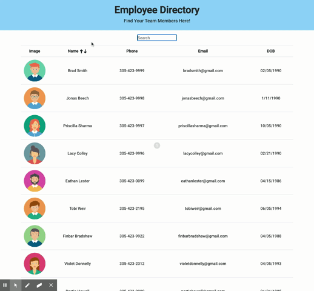
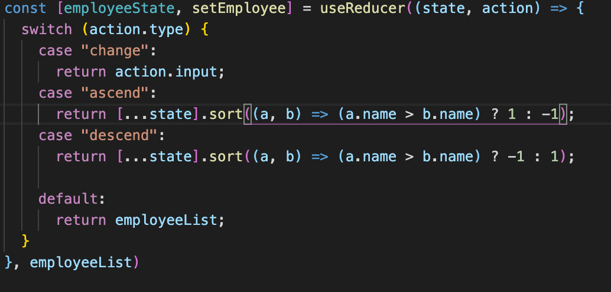

# Employee Directory

This applications helps you organize your employees' information.
[Deployment](https://anusontarangkul.github.io/employee-directory/)

## Description

You are able to find your team members in this app. You can filter by names in ascending or descending order. You can also search names into the employee directory.

## Table of Contents

- [Installation](#installation)
- [Usage](#usage)
- [Highlights](#hightlights)
- [Learned](#learned)
- [Credits](#credits)
- [License](#license)

## Installation

Click on the deployed [link](https://anusontarangkul.github.io/employee-directory/).

## Usage

To find an employee, you may enter their name in the search bar. As you type in the name, the search bar will filter employees who have those characters in their name. You can click the up arrow to organize the employees in an ascending order. You can click the down arrow to organize the employees in a descending order.

## Hightlights

UseReducer was used to organize the state of the code. We have a case for ascending, descending, and the default organization of the employee directory.

## Learned

I learned more about React by integrating a search and filter feature in the app.

## Credits

David Anusontarangkul
[LinkedIn](https://www.linkedin.com/in/anusontarangkul/)
[Github](https://github.com/anusontarangkul)

This project was apart of the UC Berkeley Coding Bootcamp.

Icons from [flaticon](https://www.flaticon.com/) were used.

## License

Copyright <2020> <COPYRIGHT HOLDER>

Permission is hereby granted, free of charge, to any person obtaining a copy of this software and associated documentation files (the "Software"), to deal in the Software without restriction, including without limitation the rights to use, copy, modify, merge, publish, distribute, sublicense, and/or sell copies of the Software, and to permit persons to whom the Software is furnished to do so, subject to the following conditions:

The above copyright notice and this permission notice shall be included in all copies or substantial portions of the Software.

THE SOFTWARE IS PROVIDED "AS IS", WITHOUT WARRANTY OF ANY KIND, EXPRESS OR IMPLIED, INCLUDING BUT NOT LIMITED TO THE WARRANTIES OF MERCHANTABILITY, FITNESS FOR A PARTICULAR PURPOSE AND NONINFRINGEMENT. IN NO EVENT SHALL THE AUTHORS OR COPYRIGHT HOLDERS BE LIABLE FOR ANY CLAIM, DAMAGES OR OTHER LIABILITY, WHETHER IN AN ACTION OF CONTRACT, TORT OR OTHERWISE, ARISING FROM, OUT OF OR IN CONNECTION WITH THE SOFTWARE OR THE USE OR OTHER DEALINGS IN THE SOFTWARE.
